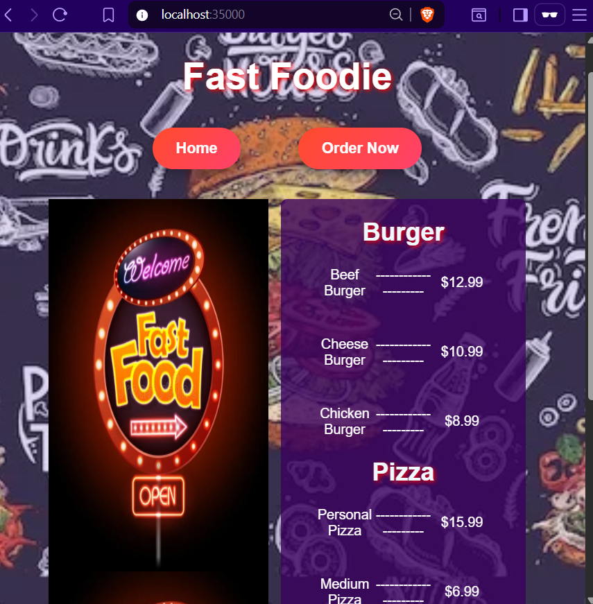
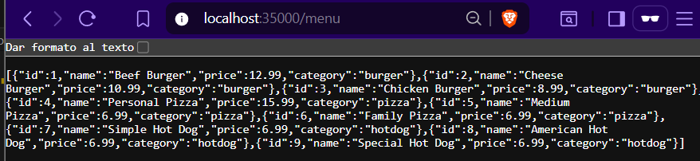
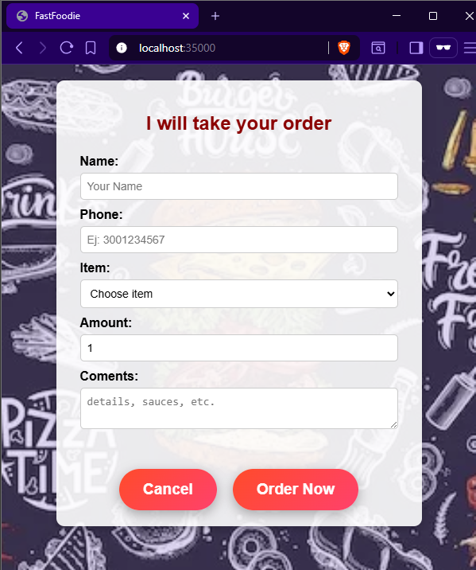
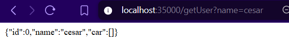
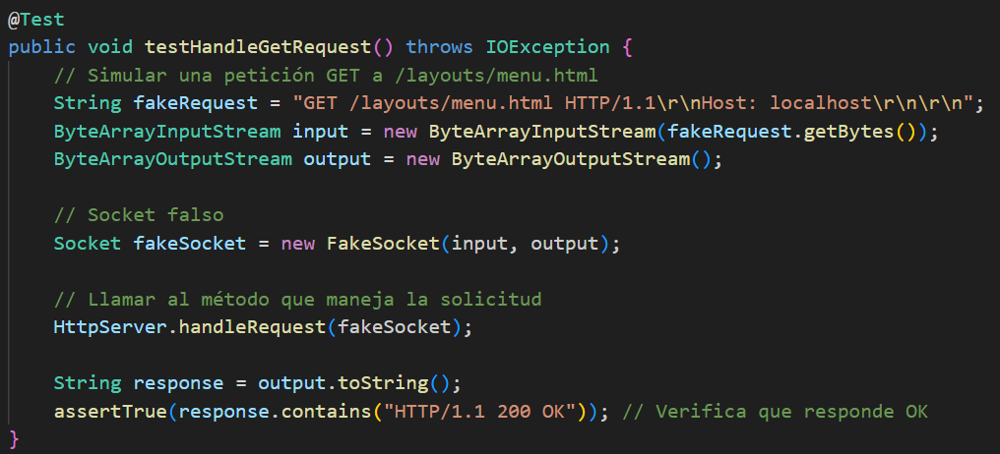

# Fast foodie - AREP_Lab02
Este proyecto implementa un servidor web HTTP básico en Java que sirve archivos estáticos (HTML, CSS, JS, imágenes) y maneja solicitudes REST para la aplicación FastFoodie. El servidor fue desarrollado sin utilizar frameworks como Spring o Spark, usando solo las librerías básicas de Java para networking (java.net) y manejo de archivos (java.io).

el servidor permite:
- Servir archivos estáticos desde carpetas configurables ```/layouts```, ```/styles```, ```/scripts```, ```/images```.

- Definir rutas REST mediante **Lambda** functions 
    - ```(get("/menu", (req, res) -> ...))```
    hace una consulta al back y devuelve en formato JSON los diferentes platillos que se ofrecen
    - ```(get("/hello", (req, res) -> ...))```.
    implementacion que se realizo en clase que retorna el nombre enviado como atributo
    - ```(get("/adduser", (req, res) -> ...))```
    crea y agrega el usuario en el backend (no invocar este metodo, ya se hace cada vez que el usuario registra el nombre. si se invoca desde el browser, no funciona)
    - ```(get("/getUser", (req, res) -> ...))```
    devuelve la informacion del usuario consultando 
        ```
        /getUser?name={nombre de usuario}
        ``` 
        es importante que el nombre del usuario sea el mismo, si no lo es no va a funcionar

- Extraer query parameters desde las solicitudes (req.getValues("param")).

# Requisitos previos
###  Java JDK 8 o superior
se pueden tener varias versiones de java JDK instaladas, pero para este proyecto es importante contar con JDK 8.

Puedes obtenerlo en el siguiente enlace:
[java JDK version 8](https://www.oracle.com/latam/java/technologies/javase/javase8-archive-downloads.html)

1. descargar el archivo compatible con el respectivo sistema operativo.

2. ejecutar el instalador y seguir todas las instrucciones.
    >Nota: se recomienda dejar todos los valores por defecto
3. Una vez instalado, busca en tu equipo **"Variables de entorno"** y ábrelo.  
4. En **Variables del sistema**, localiza la variable `JAVA_HOME` y selecciónala para **editar**.  
   - Si no existe, crea una nueva variable llamada `JAVA_HOME`.  
5. En el campo de **Valor de la variable**, coloca la ruta de instalación del JDK (por lo general):
    ```
    C:\Program Files\Java\
    ```

6. Guarda los cambios haciendo clic en **Aceptar** en todas las ventanas.  

¡Listo! El JDK quedará configurado para usarlo.

---

### Apache Maven  
Para compilar y gestionar dependencias del proyecto, es necesario tener instalado **Apache Maven**.  

Puedes obtenerlo en el siguiente enlace:  
[Descargar Apache Maven](https://maven.apache.org/download.cgi)  

1. Descarga la versión **binaria ZIP** compatible con tu sistema operativo.  
2. Extrae el contenido del archivo ZIP en una ubicación de tu preferencia.  
   > Ejemplo: `C:\apache-maven`  
3. Busca en tu equipo **"Variables de entorno"** y ábrelo.  
4. En **Variables del sistema**, localiza la variable `path` y selecciónala para **editar**.    
5. selecciona **nuevo**, coloca la ruta donde descomprimiste Maven seleccionando la carpeta bin:  
   > Ejemplo: `C:\apache-maven\bin` 
6. Guarda los cambios haciendo clic en **Aceptar** en todas las ventanas.  

#### Verificación de instalación  
Para confirmar que Maven está instalado correctamente, abre una terminal y ejecuta:  
```
mvn -version
```
Si todo está bien configurado, verás la versión de Maven, Java y el sistema operativo.

***
### Git (opcional)
Git es un sistema de control de versiones distribuido, necesario para manejar el código del proyecto.  
Podemos descargarlo desde el siguiente enlace oficial:  

[Descargar Git](https://git-scm.com/downloads)

#### Instalación:
1. Selecciona tu sistema operativo (Windows, macOS o Linux) y descarga el instalador correspondiente.
2. Ejecuta el instalador y sigue las instrucciones.
   - Se recomienda dejar las opciones por defecto, a menos que tengas una configuración específica.
3. Una vez instalado, abre una terminal o consola de comandos y verifica que Git está correctamente instalado ejecutando:
    ```
    git --version
    ```

# Primeros pasos - Implementacion en un entorno en vivo

1. **Obtener el proyecto**  
   Puedes obtener el proyecto de dos maneras:

   - **Descargando el .zip**  
     [Click aquí](https://github.com/XxELIngexX/AREP-T1.git), luego haz clic en el botón **"<> Código"** y selecciona **"Download ZIP"**.  
     Descomprime el archivo, abre una terminal y ubícate en el directorio del proyecto.

   - **Clonando el repositorio**  
     Abre una terminal y ejecuta:
     ```bash
     git clone https://github.com/XxELIngexX/AREP-T1.git
     ```
     ```
     cd AREP-T2
     ```
2. **Compilar el proyecto**
   Una vez en el directorio del proyecto, compila y descarga las dependencias con:
    ```
    mvn clean install
    ```

Esto generará los archivos compilados en la carpeta target/.


3. **Ejecutar el servidor** 
una vez compilado, ejecutar:
    ```
    java -cp target/WebServer-1.0-SNAPSHOT.jar edu.escuelaing.Lab02.app.WebApplication
    ```

# Ejemplo de uso

Una vez que el servidor esté ejecutándose:

1. Abre tu navegador y visita:
Verás la página principal de **FastFoodie**.

2. Haz clic en "Ver Menú" para obtener la lista de productos.  
Esto realiza una solicitud `fetch` al servidor y carga el archivo `menu.html` y lo s recursos que este utiliza como  los archivos de estilos `.css` y los archivos javaScript `.js` desde el backend.

    

    **nota:** (cambios a la entrega anterior) el buscador hace una consulta a ```localhost:35000/menu ``` y recibe como respuesta la informacion de los platillos que existe, esto hace mas dinamico el manu

    
    asi es como se ve la consulta al menu, esa informacion se tiene en cuenta para ponerla en el menu que vimos arriba

3. Haz clic en "Realizar Pedido" para abrir el formulario de orden.  
Completa tus datos, selecciona un producto y envía el pedido.  
El sistema mostrará un mensaje de confirmación.

    

4. si queremos consultar la informacion del usuario solo consultamos 
    ```
            /getUser?name={nombre de usuario}

    ```
    

# Ejecutando las pruebas

Este proyecto incluye un conjunto de **pruebas automatizadas con JUnit** para validar el comportamiento del servidor HTTP.  
Estas pruebas verifican el flujo completo de una petición HTTP y la respuesta generada por el "servidor", asegurando que los recursos se sirvan correctamente y que los errores sean manejados de forma adecuada.

Para ejecutar todas las pruebas:
```
mvn test
```




Esta prueba:

- Simula una solicitud GET al servidor.

- Comprueba que el servidor responde con HTTP/1.1 200 OK, indicando que el recurso fue encontrado y enviado correctamente.

También existen pruebas que:

- Validan que un recurso inexistente devuelve 404 Not Found.

- Comprueban que las solicitudes POST procesan correctamente los datos enviados.

las encontramos en 

```
src/test/java/edu/escuelaing/Lab01/HttpServerTest.java
```

o haciendo [Click aquí](src/test/java/edu/escuelaing/Lab01/HttpServerTest.java)


## Implementación

Este proyecto se puede ejecutar tanto en un entorno local como en un servidor remoto.  
En un **entorno local**, siga los pasos de la sección ["Primeros pasos"](#primeros-pasos).  

Para un **entorno en vivo**:
1. Compile el proyecto (`mvn clean install`) y copie el `.jar` generado al servidor.
2. Ejecútelo con:
   ```bash
   java -cp target/WebServer-1.0-SNAPSHOT.jar edu.escuelaing.Lab02.app.WebApplication
3. Asegúrese de que el puerto 35000 esté abierto en el firewall.

4. Verifique que las carpetas de recursos (/layouts, /styles, /scripts, /images) estén presentes en el servidor.

5. acceder a http://<IP_DEL_SERVIDOR>:35000

## Construido con
* [Java](https://www.oracle.com/java/) - Lenguaje principal
* [Maven](https://maven.apache.org/) - Gestión de dependencias
* HTML, CSS y JavaScript - Interfaz de usuario

## Autores
* **Cesar David Amaya Gomez** - Autor principal

## Licencia

Este proyecto está licenciado bajo la Licencia Pública General de GNU, versión 3 (GPLv3).  
Puedes ver una copia completa en el archivo [LICENSE](LICENSE) de este repositorio o en  
[https://www.gnu.org/licenses/gpl-3.0.html](https://www.gnu.org/licenses/gpl-3.0.html).
